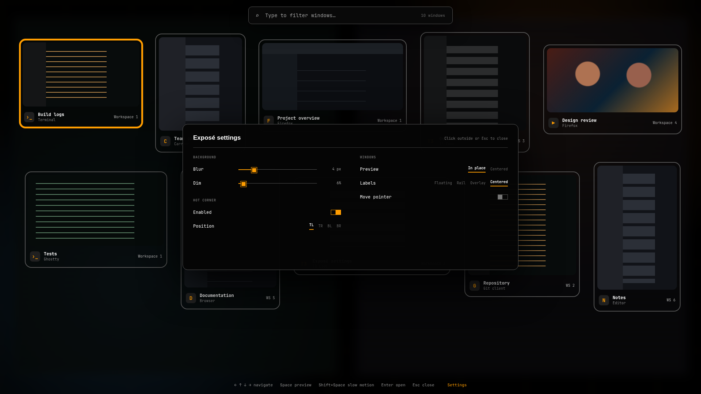

# Bird's Eye

Bird's Eye is a native Omarchy Shell overview for every open Hyprland window. It uses Quickshell's foreign-toplevel and screencopy integrations for live, clickable previews without launching a separate UI process.



> The marketplace image uses generic mock windows. Replace it with a real, privacy-reviewed screenshot before publication if desired.

## Features

- Live thumbnails for windows across all workspaces
- Responsive full-screen grid on every connected monitor
- Application icons, titles, and workspace names
- Focus and keyboard-selection highlighting
- Type-to-filter by application ID or title
- Arrow-key navigation and Enter activation
- Two-click, auto-expiring close confirmation on every card
- Live updates as windows open, close, move, or change title
- Native Omarchy colors, spacing, typography, and rounded corners
- Theme-aware fallback when a screencopy frame is unavailable
- `birdseye toggle` shell IPC endpoint

## Requirements

- Omarchy 4.0 or newer with the native shell plugin system
- Quickshell with `ToplevelManager` and `ScreencopyView`
- Hyprland with `wlr-foreign-toplevel-management` and toplevel-export screencopy support
- `hyprctl` (included with Hyprland)

## Install

From a published Git repository:

```sh
omarchy plugin add https://github.com/harel/omarchy-birdseye  --enable
```

For local development, clone/copy this repository to a Git URL, then use `omarchy plugin add <git-url> --enable`. Omarchy intentionally installs plugins from Git after validating their manifests.

Add a Hyprland binding to `~/.config/hypr/bindings.lua`:

```lua
o.bind("SUPER + A", "Bird's Eye", "omarchy-shell birdseye toggle")
```

Choose any unused chord if `SUPER + A` is already bound. Call `hl.unbind(...)` only when intentionally replacing an existing binding, and document what it replaced. Run `hyprctl reload` afterward.

## Remove

Remove the Bird's Eye lines from `~/.config/hypr/bindings.lua`, then run:

```sh
omarchy plugin disable birdseye.window-overview
omarchy plugin remove birdseye.window-overview
hyprctl reload
```

## Keyboard controls

| Key | Action |
| --- | --- |
| Arrow keys | Move selection |
| Enter | Activate the selected window |
| Escape | Close the overview |
| Any printable text | Filter by title or application |
| Backspace | Remove a filter character |
| Ctrl+Backspace | Remove a filter word |
| Ctrl+U | Clear the filter |

Mouse users can click a card to activate it. Closing a window requires two clicks on its close control within 1.6 seconds.

## Configuration

The plugin deliberately has no separate color settings: it reads Omarchy's current `Color` and `Style` tokens. Grid dimensions adapt automatically to screen size and window count. The Hyprland shortcut is user configuration and can be changed to any unused combination.

External tools can toggle, open, or close the overview:

```sh
omarchy-shell birdseye toggle
omarchy-shell birdseye open
omarchy-shell birdseye close
```

## Troubleshooting

- **No thumbnails:** verify that Hyprland exposes toplevel-export support and that no screen-capture policy blocks Quickshell. Cards remain usable with fallback labels.
- **Workspace says “—”:** Bird's Eye matches foreign-toplevel objects to `hyprctl clients -j`. Very short-lived windows or multiple identical title/class pairs can briefly be ambiguous.
- **Plugin is not listed:** run `omarchy plugin validate .`, then `omarchy-shell shell rescanPlugins`.
- **Shortcut does nothing:** run `hyprctl reload`, inspect `hyprctl configerrors`, and test `omarchy-shell birdseye toggle` directly.
- **Standalone Super:** Hyprland modifier-only bindings are not reliably distinguishable from the start of normal Super shortcuts in current configurations. A chord such as Super+Tab avoids delayed or accidental activation.

## License

MIT
