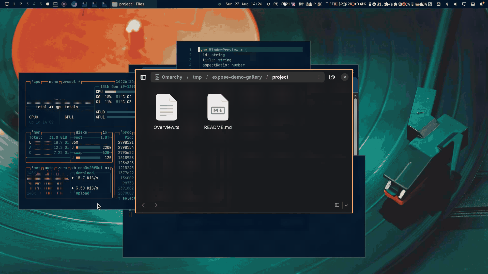

# Exposé

Improved macOS Exposé for Hyprland, with Quick Look and search.



## Improvements over macOS Exposé

macOS Exposé, now called [Mission Control](https://support.apple.com/guide/mac-help/view-open-windows-spaces-mission-control-mh35798/mac), spreads windows from the active desktop into one layer and keeps other Spaces in a strip. This version removes the desktop boundary:

- Windows from every workspace appear together, with their workspace names attached.
- The freeform layout preserves window proportions and uses the available screen instead of forcing a grid.
- Start typing to search by application or title.
- Quick Look enlarges a window in place or at the center without leaving the overview. Hold Shift for slow motion.
- The layout stays put while windows change title or workspace, making it easier to build spatial memory.
- Blur, dimming, labels, preview placement, hot corner, and pointer movement are all configurable.
- Live thumbnails, mouse and keyboard control, and Omarchy theme integration remain native to the shell.

## Requirements

- Omarchy Quattro with the native shell plugin system
- Quickshell with `ToplevelManager` and `ScreencopyView`
- Hyprland with `wlr-foreign-toplevel-management` and toplevel-export screencopy support
- Bash and `hyprctl` (included with Omarchy and Hyprland)
- `jq`
- GNU `sleep` and `timeout` (included with `coreutils`)

## Install

```sh
omarchy plugin add https://github.com/kristofferR/omarchy-expose.git --enable
```

For local development, replace the URL with your fork.

Add a Hyprland binding to `~/.config/hypr/bindings.lua`:

```lua
o.bind("SUPER + A", "Exposé", "omarchy-shell expose toggle")
```

Choose any unused chord if `SUPER + A` is already bound. Run `hyprctl reload` afterward.

## Update

```sh
omarchy plugin update expose.window-overview --yes
```

## Remove

Remove the Exposé lines from `~/.config/hypr/bindings.lua`, then run:

```sh
omarchy plugin remove expose.window-overview --yes
hyprctl reload
```

Exposé adds no packages, services, hooks, or files outside its plugin directory and its entry in `~/.config/omarchy/shell.json`.

## Keyboard controls

| Key | Action |
| --- | --- |
| Arrow keys | Move selection |
| Space | Enlarge or restore the hovered or selected window preview |
| Shift+Space | Enlarge or restore the preview in exaggerated slow motion |
| Enter | Activate the selected window |
| Escape | Restore an enlarged preview; press again to close the overview |
| Letters, numbers, and punctuation | Search by title or application |
| Backspace | Remove a search character |
| Ctrl+Backspace | Remove a search word |
| Ctrl+U | Clear the search |

Mouse users can click a card to activate it.

## Configuration

Exposé follows the active Omarchy theme. Preview positions stay fixed while the overview is open, so title and workspace updates do not reshuffle the layout.

Open **Settings** from the footer to change blur, dimming, hot-corner behavior, preview placement, labels, and pointer movement. Changes apply immediately.

Hyprland renders the background blur, keeping videos and other desktop content live. Exposé restores the previous blur setting when it closes.

The top-left hot corner is enabled by default. It toggles Exposé after the pointer enters the corner and re-arms once the pointer leaves. Disable the same corner in other hot-corner plugins to avoid overlap.

Window activation moves the pointer to the chosen window by default. This can be disabled without changing Hyprland's global cursor setting.

### IPC

```sh
omarchy-shell expose toggle
omarchy-shell expose open # Run again to close with the reverse animation
omarchy-shell expose close
omarchy-shell expose settings open
omarchy-shell expose settings close
omarchy-shell expose settings toggle
omarchy-shell expose backgroundBlur 4
omarchy-shell expose backgroundDim 6
omarchy-shell expose previewPlacement in-place
omarchy-shell expose previewPlacement centered
omarchy-shell expose windowFooterStyle floating
omarchy-shell expose windowFooterStyle integrated
omarchy-shell expose windowFooterStyle overlay
omarchy-shell expose windowFooterStyle centered
omarchy-shell expose hotCorner on
omarchy-shell expose hotCorner off
omarchy-shell expose hotCornerPosition top-left
omarchy-shell expose hotCornerPosition top-right
omarchy-shell expose hotCornerPosition bottom-left
omarchy-shell expose hotCornerPosition bottom-right
omarchy-shell expose moveCursorToWindow on
omarchy-shell expose moveCursorToWindow off
```

## Security and system changes

Exposé runs unsandboxed inside Omarchy Shell with the current user's permissions.

- Its helpers use Bash, `hyprctl`, `jq`, `sleep`, and `timeout`.
- It reads Hyprland window metadata, activates selected windows, and temporarily changes Hyprland's blur setting while open.
- Settings writes update only the plugin's entry in `~/.config/omarchy/shell.json`.
- It does not use privilege escalation or the network, install packages, create services, or run remote builds.

## Troubleshooting

- **No thumbnails:** verify that Hyprland exposes toplevel-export support and that no screen-capture policy blocks Quickshell. Cards remain usable with fallback labels.
- **Workspace says “—”:** Exposé matches foreign-toplevel objects to `hyprctl clients -j`. Very short-lived windows or multiple identical title/class pairs can briefly be ambiguous.
- **Plugin is not listed:** run `omarchy plugin validate .`, then `omarchy-shell shell rescanPlugins`.
- **Shortcut does nothing:** run `hyprctl reload`, inspect `hyprctl configerrors`, and test `omarchy-shell expose toggle` directly.
- **Standalone Super:** Hyprland modifier-only bindings are not reliably distinguishable from the start of normal Super shortcuts in current configurations. A chord such as Super+Tab avoids delayed or accidental activation.

## License

MIT
